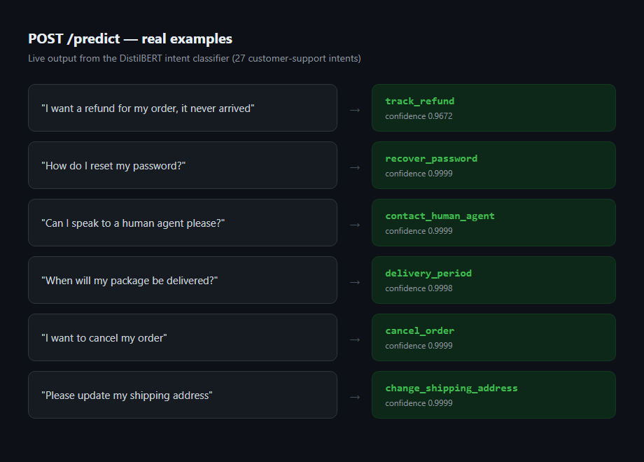

**🌐 [English](README.md) | Español | [Português](README.pt-BR.md)**

# NLP MLOps Classifier

Un Monolito Modular de nivel empresarial, listo para producción, diseñado para clasificación de intención de solicitudes de soporte al cliente de alto rendimiento. Este proyecto usa Transformers de NLP fine-tuneados, patrones de diseño de software robustos y un pipeline de DevOps completamente automatizado.

## 🎯 Qué hace

**El problema:** una empresa que recibe miles de mensajes de clientes al día ("quiero un reembolso", "¿cuándo llega mi pedido?", "olvidé mi contraseña"...) necesita que alguien lea cada uno y lo mande al equipo correcto. Hacerlo a mano es lento y caro.

**Lo que construye este proyecto:** un clasificador automático que lee el mensaje y devuelve al instante a cuál de 27 categorías pertenece (reembolso, cambio de dirección, cancelar pedido, etc.), con un porcentaje de certeza — un empleado virtual para el primer paso, repetitivo, de triage.

Cómo funciona de punta a punta:
1. **Entrenar una vez, offline:** un modelo DistilBERT se afina con miles de mensajes de ejemplo ya etiquetados (con GPU, unas horas) hasta que aprende a reconocer los patrones.
2. **Servirlo:** ese modelo entrenado queda detrás de `POST /predict` — le mandas texto, te devuelve la intención detectada + certeza, en milisegundos.
3. **Auditar cada llamada:** cada predicción se guarda en una base de datos, para poder revisar después qué se clasificó — importante en un sistema de negocio real, no solo un demo.
4. **Vigilarse a sí mismo:** los dashboards muestran volumen de peticiones, latencia, salud de la base de datos, y si el modelo se está volviendo menos seguro de lo normal con el tiempo (**drift** — señal de que el tráfico real puede estar alejándose de lo que se entrenó).
5. **Degradarse con gracia:** si la base de datos falla un momento, las predicciones le siguen llegando al cliente igual — las escrituras de auditoría fallidas se guardan en memoria y se reintentan, sin perder nada ni caerse.

Salida real del modelo corriendo:



## 📸 Capturas

| FastAPI (Swagger) | Grafana — métricas de infra + drift |
|---|---|
|  |  |

| Seguimiento de experimentos con MLflow |
|---|
|  |

## 🏛️ Diseño del sistema y decisiones arquitectónicas

Siguiendo principios de ingeniería de sistemas de alta escala, esta plataforma rechaza el sobre-diseño arquitectónico (como microservicios prematuros) a favor de una **Arquitectura Monolítica Modular** estructurada bajo **Arquitectura Hexagonal (Ports & Adapters)**. `src/domain/` contiene lógica de negocio libre de framework (modelos, ports, servicios) sin dependencias de FastAPI, SQLAlchemy o PyTorch; `src/infrastructure/` contiene cada adaptador concreto, conectado en una única raíz de composición (`src/infrastructure/api/main.py`).

### Criterios técnicos clave:
* **Canal de alta lectura (Inferencia):** Tokenización de texto e inferencia del modelo de baja latencia, ejecutadas fuera del event loop vía `run_in_threadpool` bajo `torch.inference_mode()` para que las llamadas bloqueantes de PyTorch nunca detengan el servidor async.
* **Canal de alta escritura (Logs de auditoría - Patrón Fan-In):** Escribir logs de transacciones directo a PostgreSQL en cada request HTTP crearía un cuello de botella. En su lugar, se implementa un patrón **Fan-In**: `POST /predict` responde de inmediato mientras una `asyncio.Queue` acotada y una única tarea de fondo agrupan y persisten las entradas de auditoría.
* **Resiliencia (Circuit Breaker & Timeouts):** Las escrituras por lote a la base de datos están limitadas a un **timeout estricto de 500ms**. Si la base de datos sufre una falla temporal o carga alta, un **Circuit Breaker** hecho a mano (`CLOSED → OPEN → HALF_OPEN`) se abre automáticamente. El sistema sigue sirviendo inferencias de IA con éxito mientras desvía los logs a un buffer de respaldo en memoria (`collections.deque`) hasta que la base de datos se recupera.

---

## 🚦 Fases del proyecto

* **Fase 1 — Benchmark local con GPU** (`train/train_phase1_benchmark.py`): fine-tuning de DistilBERT en `ag_news` (clasificación de tópicos de noticias, 4 clases). Corrido de verdad en una GTX 1650 (4GB VRAM): ~7h, **94.35% de accuracy**. Esto validó el pipeline de entrenamiento local con CUDA de punta a punta antes de invertir tiempo de GPU en el dataset real del producto — se dejó tal cual (comentarios en español) como un artefacto histórico honesto.
* **Fase 2 — Modelo de producto** (`train/train_intent_classifier.py`): fine-tuning de DistilBERT en [`bitext/Bitext-customer-support-llm-chatbot-training-dataset`](https://huggingface.co/datasets/bitext/Bitext-customer-support-llm-chatbot-training-dataset) (26,872 filas, 27 clases de intención balanceadas) — este es el modelo que realmente se sirve detrás de `/predict`. El entrenamiento corre localmente en GPU por el maintainer; el artefacto resultante se promueve a `src/infrastructure/ml_model/weights/` antes de empaquetarse en la imagen Docker.

## 📦 Estado actual del deploy

* La imagen Docker se construye exitosamente (`docker build .`) y pasa smoke-test (arranque → `/health` → `/predict`) en cada push a `main` vía `.github/workflows/ci-deploy.yml`, luego se publica en GHCR usando el `GITHUB_TOKEN` automático del repo — no se necesitan secrets extra para esa parte.
* `render.yaml` es un Render Blueprint completo y validado (runtime Docker, health check) — desplegado y verificado funcionalmente de punta a punta (carga del modelo desde el Hub, `/predict`, escrituras de auditoría a Postgres sobre TLS). **Se dio de baja**: el free tier de Render (512MB RAM) no soporta PyTorch + Transformers de forma confiable — se midió ~350MB solo por el import de `torch`+`transformers`, antes de cargar el modelo — así que el contenedor termina siendo matado por falta de memoria bajo carga real. Esto es una limitación del nivel de hosting, no un defecto de código: la misma imagen corre bien localmente (ver "Correr localmente") y correría bien en el plan *pago* más chico de Render sin cambiar una línea de código. El free tier de Render también permite solo una base Postgres administrada por cuenta, así que `DATABASE_URL` es una variable de entorno no administrada apuntando a un Postgres externo de nivel gratuito ([Neon](https://neon.tech)) en vez de una base administrada por Render — ver "Deploy" más abajo.
* El modelo entrenado de la Fase 2 nunca se commitea a git (267MB, en `.gitignore`) — en su lugar vive en el [Hugging Face Hub](https://huggingface.co/hard717/intent-classifier-customer-support). `MODEL_PATH` es una ruta local (`docker-compose`, promovida tras un entrenamiento local) o un repo id del Hub (Render), y `AutoModel.from_pretrained` maneja ambos casos de forma transparente, sin ninguna ramificación de código.
* **El pipeline de promoción de modelo (`.github/workflows/model-promotion.yml`) es latente por diseño.** Compara el último run de MLflow contra el modelo con alias `production` en el MLflow Model Registry y lo promueve si no es peor (ver `train/promote_model.py`) — pero no hace nada hasta que se agregue `MLFLOW_TRACKING_URI` como secret del repo apuntando a un servidor MLflow *alcanzable*, ya que la instancia local de docker-compose no es alcanzable desde un runner de GitHub. El reentrenamiento automático real de punta a punta también necesita un runner con GPU (el entrenamiento toma horas en una GPU de consumo); esa parte se mantiene como un paso manual deliberado por ahora.

---

## 🛠️ Stack tecnológico

* **Backend principal:** Python 3.11 + FastAPI (framework asíncrono)
* **Motor de IA:** PyTorch + Hugging Face Transformers (DistilBERT base)
* **Persistencia:** PostgreSQL 16 vía SQLAlchemy 2.0 (async) + migraciones Alembic
* **Infraestructura y seguridad:** Nginx (Proxy Reverso, Rate-Limiting, terminación SSL)
* **DevOps e IaC:** Docker, Docker Compose, Render Blueprints (`render.yaml`)
* **Pipeline CI/CD:** GitHub Actions — `ci-pipeline.yml` (lint + tests unitarios + integración con Postgres) y `ci-deploy.yml` (build, smoke-test, publicación en GHCR)
* **MLOps — Seguimiento de experimentos:** MLflow (servidor local, backend sqlite) — cada run de entrenamiento de la Fase 2 registra hiperparámetros, accuracy/F1 por época, y el artefacto final del modelo
* **MLOps — Monitoreo en producción:** Prometheus (latencia/throughput de la API, scrapeado desde `/metrics`) + Grafana (dashboards sobre Prometheus y directo sobre la tabla `audit_logs` de Postgres para métricas de modelo/negocio)

---

## 📂 Estructura del repositorio

```text
nlp-mlops-classifier/
│
├── .github/workflows/
│   ├── ci-pipeline.yml          # Lint + tests unitarios + integración con Postgres (etapa CI)
│   ├── ci-deploy.yml            # Build, smoke-test, publicación en GHCR (etapa CD)
│   └── model-promotion.yml      # Latente: evaluación+promoción en MLflow, no-op hasta configurar MLFLOW_TRACKING_URI
│
├── src/                         # Núcleo de Arquitectura Hexagonal
│   ├── domain/                  # Lógica de negocio libre de framework: modelos, ports, servicios
│   └── infrastructure/          # Adaptadores externos (API, DB, Transformers)
│       ├── api/                 # Factory de la app FastAPI, routers, schemas — raíz de composición
│       ├── database/            # Modelos/sesión de SQLAlchemy, repo de auditoría, batch writer Fan-In
│       ├── ml_model/            # Adaptador de inferencia PyTorch + weights/ (en .gitignore)
│       ├── observability/       # Gauges de Prometheus: estado del circuit breaker, drift de confianza
│       └── resilience/          # Circuit Breaker hecho a mano
│
├── alembic/                     # Entorno de migraciones async (tabla audit_logs)
│
├── train/                       # Entorno de entrenamiento local aislado (GPU/CUDA)
│   ├── common.py                 # Helper compartido detect_device()
│   ├── train_phase1_benchmark.py # Fase 1: benchmark en ag_news con GPU (histórico, español)
│   ├── train_intent_classifier.py# Fase 2: modelo de intención de soporte al cliente, con tracking en MLflow
│   └── promote_model.py          # Registry de MLflow: promueve el último run si no regresiona
│
├── infra/                       # Infraestructura como Código (IaC)
│   ├── nginx/                   # Perfiles de ruteo del Proxy Reverso
│   ├── prometheus/              # Config de scraping para /metrics de la API
│   ├── grafana/                 # Provisioning de datasources + dashboard (Prometheus + Postgres)
│   └── docker-compose.yml       # Orquestación local de 6 contenedores (API, DB, proxy + stack MLOps)
│
├── docs/screenshots/            # Capturas del README (Swagger, Grafana, MLflow)
├── render.yaml                  # Manifiesto de Render Blueprint (raíz del repo — ubicación default de Render)
├── tests/                       # Suite de Pytest (unitarios + @pytest.mark.integration)
├── Dockerfile                   # Build multi-stage de producción (torch CPU-only)
├── requirements.txt             # Dependencias de producción
├── requirements-dev.txt         # + pytest, httpx, flake8
└── LICENSE                      # Licencia MIT
```

---

## 🚀 Correr localmente

```bash
cd infra
docker-compose up --build
```

Esto levanta seis contenedores: `postgres_db`, `api_service`, `nginx_proxy`, `mlflow`, `prometheus` y `grafana`. Una vez saludables:

```bash
curl http://localhost/health
curl -X POST http://localhost/predict -H "Content-Type: application/json" \
  -d '{"text": "I want to cancel my order"}'
```

Requiere un artefacto de modelo promovido en `src/infrastructure/ml_model/weights/` (ver "Reentrenar" abajo) — el contenedor `api_service` fallará al arrancar sin él.

## 📈 Monitoreo y observabilidad

* **MLflow** (`http://localhost:5000`): cada run de entrenamiento de la Fase 2 aparece acá automáticamente — hiperparámetros, accuracy/F1 por época, y el artefacto del modelo guardado. Levantarlo antes de entrenar: `docker compose -f infra/docker-compose.yml up -d mlflow`. `train/train_intent_classifier.py` apunta a `http://localhost:5000` por defecto (se puede sobreescribir con `MLFLOW_TRACKING_URI`).
* **Prometheus** (`http://localhost:9090`): scrapea `GET /metrics` de la API corriendo cada 5s — tasa de requests, histogramas de latencia por ruta, y el estado actual del circuit breaker de la base de auditoría (`circuit_breaker_state`: 0=cerrado, 1=abierto, 2=half_open).
* **Grafana** (`http://localhost:3000`, acceso anónimo de solo lectura habilitado — `admin`/`admin` para editar): el dashboard *"NLP MLOps Classifier - Overview"* se provisiona automáticamente al arrancar con dos tipos de paneles — métricas de infra desde Prometheus (tasa de requests, latencia p95, estado del breaker) y métricas de producto consultadas directo de la tabla `audit_logs` (distribución de intents, confianza promedio en el tiempo, volumen de predicciones).
* **Detección de drift** (`src/infrastructure/observability/drift.py`): una tarea de fondo dentro de la API recalcula la confianza promedio móvil de las predicciones cada `drift_check_interval_seconds` (5 min por defecto) y la compara contra `drift_baseline_confidence` (la confianza del set de validación de la Fase 2). La diferencia se expone como `prediction_drift_score` en `/metrics` — visible en Grafana — y se registra como warning al superar `drift_alert_threshold`. Es un proxy sin etiquetas: el drift real de accuracy necesita labels de verdad que el tráfico de producción no tiene, pero una caída sostenida en la confianza suele ser el primer síntoma visible.

## 🔁 Reentrenar

```bash
pip install -r requirements-dev.txt
docker compose -f infra/docker-compose.yml up -d mlflow   # opcional pero recomendado: habilita tracking
python -m train.train_intent_classifier
# promover el artefacto elegido:
cp -r models/intent_classifier_customer_support/* src/infrastructure/ml_model/weights/
# y, para servirlo desde un repo que nunca envía los pesos (ej. Render):
hf upload <tu-usuario-hf>/intent-classifier-customer-support models/intent_classifier_customer_support .
```

## ☁️ Deploy (Render + Neon + Hugging Face Hub)

El nivel gratuito de cada pieza acá tiene un límite, así que las piezas se separan en vez de usar la base de datos todo-en-uno del Blueprint de Render:

1. **Modelo**: subir el artefacto promovido a un repo de modelo en Hugging Face Hub (ver "Reentrenar" arriba). Configurar `MODEL_PATH` con ese repo id en vez de una ruta local.
2. **Base de datos**: el plan gratis de Render solo permite una base Postgres activa por cuenta. Crear un proyecto gratis en [Neon](https://neon.tech) en su lugar, y copiar su connection string.
3. **Web service**: [dashboard.render.com/blueprint/new](https://dashboard.render.com/blueprint/new) → apuntar a este repo/rama → Render lee `render.yaml` y provisiona el web service `nlp-mlops-classifier` (sin base de datos, ya que `render.yaml` ya no define una).
4. En el servicio creado → **Environment**, configurar `DATABASE_URL` con la connection string de Neon (queda como variable no administrada/manual en el blueprint a propósito).
5. Opcional: agregar `RENDER_DEPLOY_HOOK_URL` (Servicio → Settings → Deploy Hook) como secret de GitHub Actions para activar el paso de auto-deploy ya presente en `ci-deploy.yml`.

## ✅ Tests

```bash
pip install -r requirements-dev.txt
flake8 .
pytest tests/ -m "not integration"      # no necesita servicios externos
pytest tests/ -m integration            # requiere Postgres, ej. `docker-compose up postgres_db`
```
