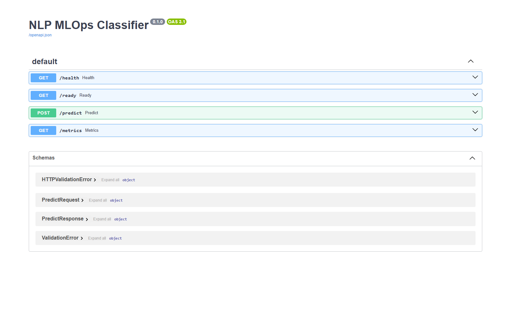
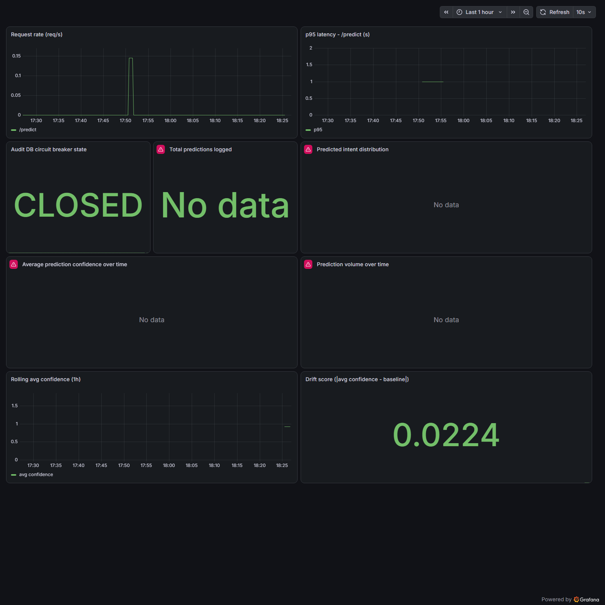
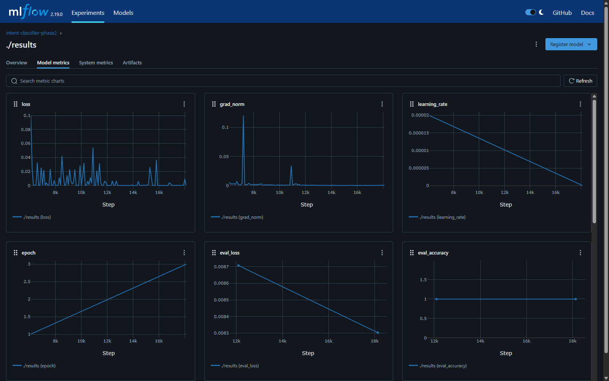

**🌐 English | [Español](README.es.md) | [Português](README.pt-BR.md)**

# NLP MLOps Classifier

An enterprise-grade, production-ready Modular Monolith designed for high-throughput customer support intent classification. This project leverages fine-tuned NLP Transformers, robust software design patterns, and a complete automated DevOps pipeline.

## 📸 Screenshots

| FastAPI (Swagger) | Grafana — infra + drift metrics |
|---|---|
|  |  |

| MLflow experiment tracking |
|---|
|  |

## 🏛️ System Design & Architectural Decisions

Following high-scale system engineering principles, this platform rejects architectural overengineering (such as premature microservices) in favor of a **Modular Monolithic Architecture** structured under **Hexagonal Architecture (Ports & Adapters)**. `src/domain/` contains framework-free business logic (models, ports, services) with zero dependencies on FastAPI, SQLAlchemy, or PyTorch; `src/infrastructure/` holds every concrete adapter, wired together at a single composition root (`src/infrastructure/api/main.py`).

### Key Technical Criteria:
* **High-Read Channel (Inference):** Low-latency text tokenization and model inference, run off the event loop via `run_in_threadpool` under `torch.inference_mode()` so blocking PyTorch calls never stall the async server.
* **High-Write Channel (Auditory Logs - Fan-In Pattern):** Writing transaction logs directly to PostgreSQL on every HTTP request would bottleneck the system. Instead, a **Fan-In** pattern is implemented: `POST /predict` responds immediately while a bounded `asyncio.Queue` and a single background task batch and persist audit entries.
* **Resiliency (Circuit Breaker & Timeouts):** Database batch writes are constrained to a strict **500ms timeout**. If the database experiences a temporary failure or heavy load, a hand-rolled **Circuit Breaker** (`CLOSED → OPEN → HALF_OPEN`) opens automatically. The system continues to serve AI inferences successfully while diverting logs to an in-memory fallback buffer (`collections.deque`) until the database recovers.

---

## 🚦 Project Phases

* **Phase 1 — Local GPU benchmark** (`train/train_phase1_benchmark.py`): fine-tunes DistilBERT on `ag_news` (4-class news topic classification). Run for real on a GTX 1650 (4GB VRAM): ~7h, **94.35% accuracy**. This validated the local CUDA training pipeline end to end before committing GPU time to the actual product dataset — kept as-is (Spanish comments) as an honest historical artifact.
* **Phase 2 — Product model** (`train/train_intent_classifier.py`): fine-tunes DistilBERT on [`bitext/Bitext-customer-support-llm-chatbot-training-dataset`](https://huggingface.co/datasets/bitext/Bitext-customer-support-llm-chatbot-training-dataset) (26,872 rows, 27 balanced intent classes) — this is the model actually served behind `/predict`. Training is run locally on GPU by the maintainer; the resulting artifact is promoted into `src/infrastructure/ml_model/weights/` before it ships in the Docker image.

## 📦 Current Deployment Status

* Docker image builds successfully (`docker build .`) and is smoke-tested (boot → `/health` → `/predict`) on every push to `main` via `.github/workflows/ci-deploy.yml`, then published to GHCR using the repo's automatic `GITHUB_TOKEN` — no extra secrets required for that part.
* `render.yaml` is a complete, validated Render Blueprint (Docker runtime, health check) — deployed and functionally verified end to end (model load from the Hub, `/predict`, Postgres audit writes over TLS). **It was taken back down**: Render's free tier (512MB RAM) can't hold PyTorch + Transformers reliably — measured at ~350MB for the bare `torch`+`transformers` import alone, before the model - so the container gets OOM-killed under real load. This is a hosting-tier constraint, not a code defect: the same image runs fine locally (see "Run locally") and would run fine on Render's smallest *paid* plan with zero code changes. Render's free tier also caps out at one managed Postgres per account, so `DATABASE_URL` is an unmanaged env var pointed at an external free-tier Postgres ([Neon](https://neon.tech)) instead of a Render-managed database — see "Deploy" below.
* The trained Phase 2 model is never committed to git (267MB, gitignored) - it's hosted on the [Hugging Face Hub](https://huggingface.co/hard717/intent-classifier-customer-support) instead. `MODEL_PATH` is either a local path (`docker-compose`, promoted after a local training run) or a Hub repo id (Render), and `AutoModel.from_pretrained` handles both transparently with zero code branching.
* **Model promotion pipeline (`.github/workflows/model-promotion.yml`) is latent by design.** It compares the latest MLflow run against the model aliased `production` in the MLflow Model Registry and promotes it if it isn't worse (see `train/promote_model.py`) - but it's a no-op until `MLFLOW_TRACKING_URI` is added as a repo secret pointing at a *reachable* MLflow server, since the local docker-compose instance isn't reachable from a GitHub-hosted runner. Real end-to-end automated retraining also needs a GPU runner (training takes hours on a consumer GPU); that part stays a deliberate manual step for now.

---

## 🛠️ Tech Stack

* **Core Backend:** Python 3.11 + FastAPI (Asynchronous framework)
* **AI Engine:** PyTorch + Hugging Face Transformers (DistilBERT base)
* **Persistence:** PostgreSQL 16 via SQLAlchemy 2.0 (async) + Alembic migrations
* **Infrastructure & Security:** Nginx (Reverse Proxy, Rate-Limiting, SSL termination)
* **DevOps & IaC:** Docker, Docker Compose, Render Blueprints (`render.yaml`)
* **CI/CD Pipeline:** GitHub Actions — `ci-pipeline.yml` (lint + unit + Postgres-integration tests) and `ci-deploy.yml` (build, smoke-test, GHCR publish)
* **MLOps — Experiment Tracking:** MLflow (local server, sqlite backend) — every Phase 2 training run logs hyperparameters, per-epoch accuracy/F1, and the final model artifact
* **MLOps — Production Monitoring:** Prometheus (API latency/throughput scraped from `/metrics`) + Grafana (dashboards over Prometheus and directly over the `audit_logs` Postgres table for model/business metrics)

---

## 📂 Repository Structure

```text
nlp-mlops-classifier/
│
├── .github/workflows/
│   ├── ci-pipeline.yml          # Lint + unit + Postgres-integration tests (CI Stage)
│   ├── ci-deploy.yml            # Build, smoke-test, GHCR publish (CD Stage)
│   └── model-promotion.yml      # Latent: MLflow eval + promotion, no-op until MLFLOW_TRACKING_URI is set
│
├── src/                         # Hexagonal Architecture Core
│   ├── domain/                  # Framework-free business logic: models, ports, services
│   └── infrastructure/          # External Adapters (API, DB, Transformers)
│       ├── api/                 # FastAPI app factory, routers, schemas — composition root
│       ├── database/            # SQLAlchemy models/session, audit repo, Fan-In batch writer
│       ├── ml_model/            # PyTorch inference adapter + weights/ (gitignored)
│       ├── observability/       # Prometheus gauges: circuit breaker state, confidence drift
│       └── resilience/          # Hand-rolled Circuit Breaker
│
├── alembic/                     # Async migration environment (audit_logs table)
│
├── train/                       # Isolated Local Training Environment (GPU/CUDA)
│   ├── common.py                 # Shared detect_device() helper
│   ├── train_phase1_benchmark.py # Phase 1: ag_news GPU benchmark (historical, Spanish)
│   ├── train_intent_classifier.py# Phase 2: customer-support intent model, MLflow-tracked
│   └── promote_model.py          # MLflow registry: promote latest run if it doesn't regress
│
├── infra/                       # Infrastructure as Code (IaC)
│   ├── nginx/                   # Reverse Proxy routing profiles
│   ├── prometheus/              # Scrape config for the API's /metrics
│   ├── grafana/                 # Datasource + dashboard provisioning (Prometheus + Postgres)
│   └── docker-compose.yml       # 6-Container Local Orchestration (API, DB, proxy + MLOps stack)
│
├── docs/screenshots/            # README screenshots (Swagger, Grafana, MLflow)
├── render.yaml                  # Render Blueprint Manifest (repo root — Render's default lookup)
├── tests/                       # Pytest suite (unit + @pytest.mark.integration)
├── Dockerfile                   # Multi-Stage Production Build (CPU-only torch)
├── requirements.txt             # Production dependencies
├── requirements-dev.txt         # + pytest, httpx, flake8
└── LICENSE                      # MIT License
```

---

## 🚀 Run locally

```bash
cd infra
docker-compose up --build
```

This boots six containers: `postgres_db`, `api_service`, `nginx_proxy`, `mlflow`, `prometheus`, and `grafana`. Once healthy:

```bash
curl http://localhost/health
curl -X POST http://localhost/predict -H "Content-Type: application/json" \
  -d '{"text": "I want to cancel my order"}'
```

Requires a promoted model artifact at `src/infrastructure/ml_model/weights/` (see "Retrain" below) — the `api_service` container will fail to start without it.

## 📈 Monitoring & Observability

* **MLflow** (`http://localhost:5000`): every Phase 2 training run appears here automatically — hyperparameters, per-epoch accuracy/F1, and the saved model artifact. Start it before training: `docker compose -f infra/docker-compose.yml up -d mlflow`. `train/train_intent_classifier.py` points at `http://localhost:5000` by default (override with `MLFLOW_TRACKING_URI`).
* **Prometheus** (`http://localhost:9090`): scrapes `GET /metrics` on the running API every 5s — request rate, latency histograms per route, and the audit-DB circuit breaker's current state (`circuit_breaker_state`: 0=closed, 1=open, 2=half_open).
* **Grafana** (`http://localhost:3000`, anonymous viewer access enabled — `admin`/`admin` for editing): the *"NLP MLOps Classifier - Overview"* dashboard is provisioned automatically on startup with two kinds of panels — infra metrics from Prometheus (request rate, p95 latency, breaker state) and product metrics queried directly from the `audit_logs` table (intent distribution, average confidence over time, prediction volume).
* **Drift detection** (`src/infrastructure/observability/drift.py`): a background task inside the API recomputes the rolling average prediction confidence every `drift_check_interval_seconds` (default 5 min) and compares it against `drift_baseline_confidence` (the Phase 2 validation-set confidence). The gap is exposed as `prediction_drift_score` on `/metrics` - visible in Grafana - and logged as a warning past `drift_alert_threshold`. It's a label-free proxy: real accuracy drift needs ground-truth labels that production traffic doesn't have, but a sustained confidence drop is usually the first visible symptom of it.

## 🔁 Retrain

```bash
pip install -r requirements-dev.txt
docker compose -f infra/docker-compose.yml up -d mlflow   # optional but recommended: enables tracking
python -m train.train_intent_classifier
# promote the chosen artifact:
cp -r models/intent_classifier_customer_support/* src/infrastructure/ml_model/weights/
# and, to serve it from a repo that never ships the weights (e.g. Render):
hf upload <your-hf-username>/intent-classifier-customer-support models/intent_classifier_customer_support .
```

## ☁️ Deploy (Render + Neon + Hugging Face Hub)

The free tier of every piece here has a catch, so the pieces are split up rather than using Render's all-in-one Blueprint database:

1. **Model**: push the promoted artifact to a Hugging Face Hub model repo (see "Retrain" above). Set `MODEL_PATH` to that repo id instead of a local path.
2. **Database**: Render's free plan allows only one active free Postgres per account. Create a free project on [Neon](https://neon.tech) instead, and copy its connection string.
3. **Web service**: [dashboard.render.com/blueprint/new](https://dashboard.render.com/blueprint/new) → point at this repo/branch → Render reads `render.yaml` and provisions the `nlp-mlops-classifier` web service (no database, since `render.yaml` no longer defines one).
4. In the created service → **Environment**, set `DATABASE_URL` to the Neon connection string (it's left as an unmanaged/manual var in the blueprint on purpose).
5. Optional: add `RENDER_DEPLOY_HOOK_URL` (Service → Settings → Deploy Hook) as a GitHub Actions secret to activate the auto-deploy step already present in `ci-deploy.yml`.

## ✅ Tests

```bash
pip install -r requirements-dev.txt
flake8 .
pytest tests/ -m "not integration"      # no external services needed
pytest tests/ -m integration            # requires Postgres, e.g. `docker-compose up postgres_db`
```
